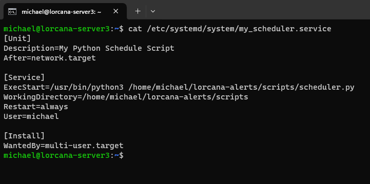

**Summary:** Lorcana is a Disney trading card game created by Ravensburger. An important aspect to many collectors of trading card games is knowledge about card price trends. As Lorcana is a new game released in August 2023, there were no tools available to access data related to price trends. 

My posts related to this project are only a brief summary. Most of the work was done in my spare time over the course of ~5 months. During the project, I explored a wide variety of technologies and approaches to each challenge I encountered. For more information, check out the project on my [GitHub](https://github.com/mmelton1/lorcana-alerts).

## Objective:

1. Build a presence on social media and automate posts for card price analysis.
2. Create a website which allows for people to view price analysis and trends for cards.

**Objective 1:** *Build a presence on social media and automate posts for card price analysis*

To start, I first thought about what I'd need in order to accomplish my goal. I knew I needed the following capabilities:

1. Accessing pricing data for every Lorcana card
2. Storing data in a database
3. Automating and executing python scripts
4. Automating social media posts

#### 1. Accessing pricing data for every Lorcana card
I decided to base the card pricing data off of [TCG Player's](https://www.tcgplayer.com/) pricing, as it is one of the most popular marketplaces for trading card games. Also, they offer API access to TCG parters. Next, I reached out to their team and filled out the necessary paperwork. After some time, I was accepted into the TCG Player affiliate program, which allowed me to earn commission on sales I referred to their website. More importantly, I received API access.

With my new API keys in hand, I got to work testing and understanding the TCG player API endpoints. I decided to use Python, as it's a language I'm comfortable with. The first script I wrote was a way to obtain an access token that I could use to make API requests. Then, I identified which endpoints I needed in order to pull a list of every TCG product I wanted to track prices for, as well as the endpoint I needed in order to access pricing data for each product. 

At this point, I was able to access all of the data I needed, but I needed somewhere to store it.

#### 2. Storing data in a database
For the database, I decided to use a Azure Database for MySQL flexible server, as it has low cost, minimal upkeep, and I'm comfortable with MySQL. Once the database was setup up, I used the mysql.connector for Python in order to connect to it. Then, I created a script to create tables using python. Finally, I installed Navicat so that I had an easy way of managing my database from a GUI.

From here, I took some time to decide the structure of my data. I setup tables for storing ids, prices, product info, tweets, and my TCG player access token (as this needed to be regenerated every few weeks). Then, I created my main script to pull pricing data for every Lorcana product on TCG player. Since my goal is to analyize price data over time for products, I needed a way to run this script every day on a schedule.

#### 3. Automating and executing scripts

For this requirement, I opted to use an Ubuntu virtual machine hosted on Azure. I updated packages on the server and installed the latest version of Python. By this point, I had already created a git repo and have been pushing changes from my local development machine. On the server, I only wanted to pull changes. I accomplished this by setting up a personal access token.

Now, for the most important part: automation. I tried a few different methods to accomplish this (including using cron/systemd on my server to schedule python scripts), but ultimately settled on the python schedule framework. Using schedule, I was able to run any of my python scripts on a set schedule. Some scripts run hourly, every day, once a week, etc. Then, I set my schedule.py script to automatically start when the server boots up. With my scheduler in place, I was writing pricing data for each Lorcana card every day to my database.

#### 4. Social media

The last piece of the puzzle was to automate posting to social media platforms. I identified that X (the platform formerly known as Twitter) seemed to have the healthiest community when compared to other social media platforms for the Lorcana trading card game. I researched how to programmatically interact with X, and signed up for a developer account. Once I had API access, I read the documentation to learn how to authenticate with my account and create X posts.  

Next, I wrote some additional python scripts to perform analysis on the data in my database. I wanted to know for each product, what was the price change percentage for the past 24 hours, and the past 7 days. To accomplish this, I queried my database then creating a function to analyze the data using Pandas (a data analysis framework for Python). From there, I identified the products which had the largest price percent changes, then added them to a table in my database. Finally, another script would process each row in the table, post them to X with an affiliate link to TCG player, and mark the record as posted.

Unfortunately, I ran into a roadblock with the character limits on X. The hyperlinks I was including in the posts were lengthy and didn't leave much space for other characters. I decided that I needed to use a URL shortener. However, I anticpated the need for hundreds of unique links (one for each Lorcana product), and as it turns out, URL shorteners don't seem to support that many short URLs for free. 

After some research, I discovered [YOURLS](https://yourls.org/), a self-hosted URL shortner. Since I already had a server in Azure, I'd be able to easily implement this solution. I went ahead and registered a domain with [Cloudflare](https://www.cloudflare.com/), as it provides SSL certs and a whole suite of useful tools for managing domains. It took some tinkering, but I eventually got YOURLS working, along with bulk URL generation. With YOURLS configured, I now had a unique short URL for each Lorcana product, which included my affiliate link.

Within a few months of automated posting of Lorcana price movements, my X account was growing in followers and my short URLs were receiving more hits. Things were going well, but I wanted to offer a lot more, so I started working on a website for the project.

*[Click here for Part 2](lorcanalytics-2)*