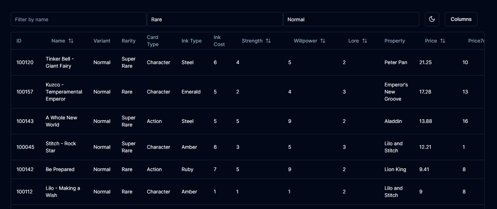
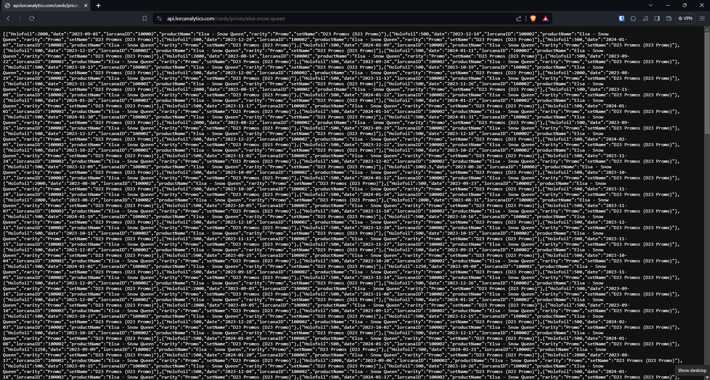
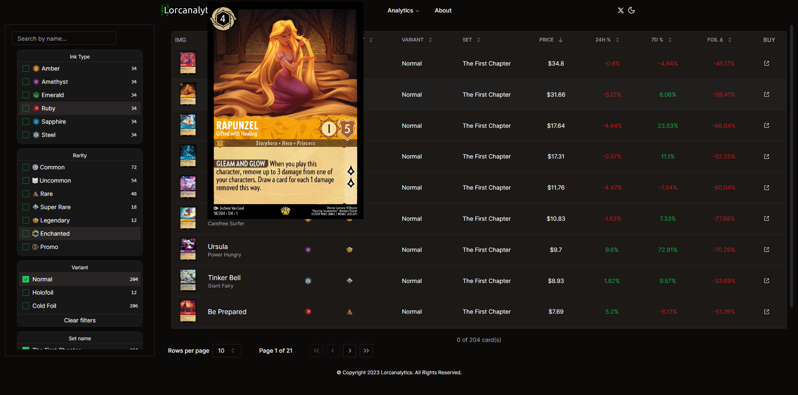
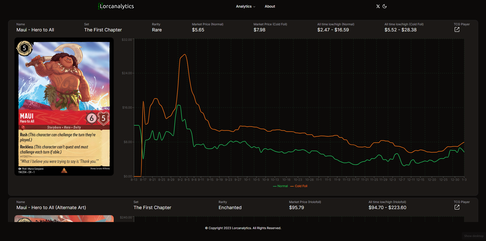
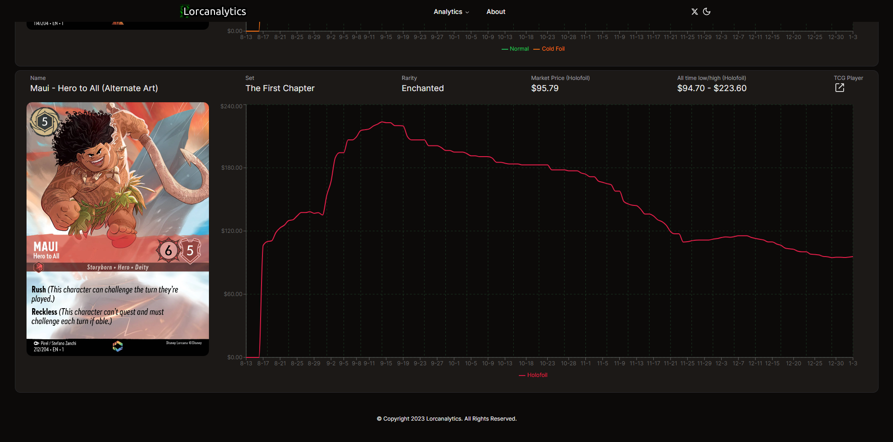
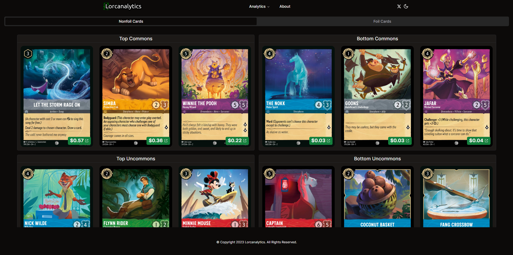
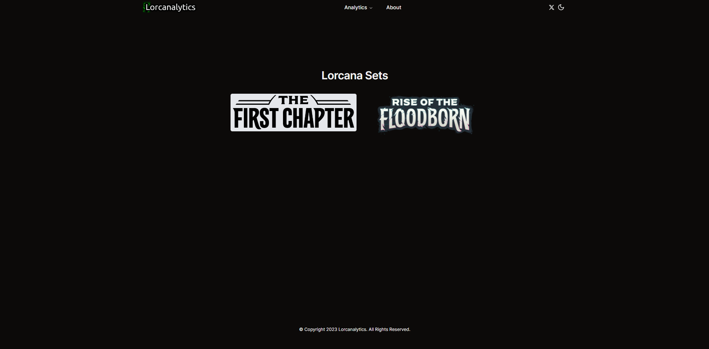
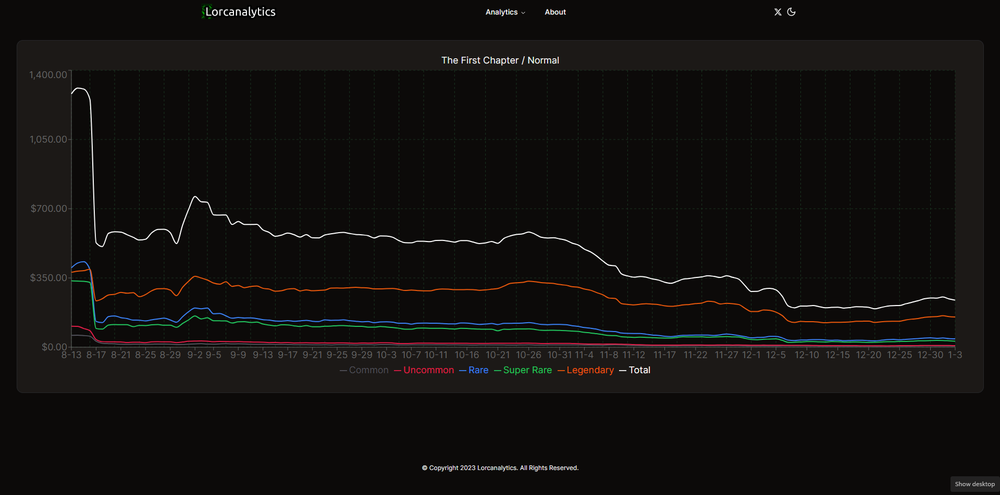

**Summary:** Lorcana is a Disney trading card game created by Ravensburger. An important aspect to many collectors of trading card games is knowledge about card price trends. As Lorcana is a new game released in August 2023, there were no tools available to access data related to price trends. 

My posts related to this project are only a brief summary. Most of the work was done in my spare time over the course of ~5 months. During the project, I explored a wide variety of technologies and approaches to each challenge I encountered. For more information, check out the project on my [GitHub](https://github.com/mmelton1/lorcana-alerts). To see a video of the site, click [here](https://youtu.be/aT53lUtIRuc).

## Objectives:

1. Build a presence on social media and automate posts for card price analysis.
2. Create a website which allows for people to view price analysis and trends for cards.

**Objective 2:** *Create a website which allows for people to view price analysis and trends for cards*

For the next objective, I wanted to make a website which allowed people to better visualize all of the data I've been collecting. The automated posts to X were useful to see any major price movements at a glance, but I wanted to provide more interactive experience. In order to accomplish this, I needed the following:

1. Setup a frontend for the website
2. Create a REST API for backend data
3. Display data using interactive components
4. Deploy website using Docker

### Setup a frontend for the website
It had been years since I worked with any frontend frameworks, so I started by researching some of the more popular options such as React and Vue, to newer frameworks like Svelte. I knew that I wanted a framework with a strong community and good support, and I also wanted a framework I could easily support data tables and chart visualizations. While all of the frameworks I looked at seemed more than capable, [Next.js](https://nextjs.org/) (which is built on React) fit the bill for me. Next.js' performance, community, and workflow made it an easy choice for me to start building my website with. Furthermore, the [NextUI](https://nextui.org/) component library seemed like a great option to easily build out some of the features I wanted. Here's an early version of one of the data tables I created:



Over the next few weeks, I built out all of the major features I wanted to have before launching the site. I was mostly satisfied with the way the site worked and looked, but the performance of the main section of the site (where I display all card data in a table) was lacking, especially when sorting large data sets. Admittedly, I'm not an experienced frontend dev, so there's probably a solution out there. However, I wasn't able to fix the optimization issues, and there were several visual annoyances I had. What I discovered with NextUI was that it was easy to get started with, but difficult to customize. This led me to research other react component libraries, which is when I discovered [shadcn](https://ui.shadcn.com/).

I spent another few weeks continuing to improve the website and implementing shadcn. One major strength of shadcn is that the components are much more customziable than NextUI. Also, the data table performance was much better. From here, I implemented a few other systems and I was very satisfied with how the site was operating with one exception. I needed a way to update the data on the wbesite reguarly.

### Create a REST API for backend data
Since the backend of my website was built using Python, I decided to use [Flask](https://flask.palletsprojects.com/en/3.0.x/), which is a lightweight python web framework. With flask, I could access data from my database and serve the data over a URL. 

At first, I used various python scripts to query my database, performed analysis on the data, and generated a .CSV file. Then, I'd use flask to serve that file at a specific URL. This worked for most of the components on my site, but I knew that I eventually wanted to generate dynamic URLs so that each Lorcana card had a unique web page. In order to accomplish this, I moved away from generating and serving .CSV files. Intead, I began using SQL statements directly in my Flask application in order to provide on-demand data whenever a particular URL was visited. 

Around this same time, I was learning the basics of Golang. I've read that Go is great to use as a backend language, and I wanted a project to practice using Go. So, I decided to rebuild the Flask functionality using Go. As I'm a Go newbie, I was surprised the REST API went together relatively easily and worked great. Finally, I was able to create URL endpoints to pull all of the data I needed by accessing the URLs I had set up. With this in place, I could focus on displaying the data in more interesting ways.

Here's a snippet of code I used to display json data about any specific card by visiting api.lorcanalytics.com/cards/prices/{card-name}. First, I defined the URL path in the router, then queried my database in the getCardPrices function and displayed the output in a specific format.

```
// Define routes
router := mux.NewRouter()
c := cors.New(cors.Options{
    AllowedOrigins: []string{"https://lorcanalytics.com"}, // Specify the allowed origin(s)
    AllowedMethods: []string{"GET"},                       // Add the HTTP methods you need
    AllowedHeaders: []string{"Content-Type"},              // Add the allowed headers
})
handler := c.Handler(router)
router.HandleFunc("/cards/prices/{cardurl}", getCardPrices).Methods("GET")

// Get card details and prices
func getCardPrices(w http.ResponseWriter, r *http.Request) {
	w.Header().Set("Cache-Control", "no-cache, no-store, must-revalidate")
	w.Header().Set("Pragma", "no-cache")
	w.Header().Set("Expires", "0")
	w.Header().Set("Content-Type", "application/json")
	vars := mux.Vars(r)
	productURL := vars["cardurl"]
	var cardPrices []map[string]interface{}
	result, err := db.Query("SELECT productName, lorcanaID, productURL, marketPrice, rarity, setName, variant, date , promoType FROM `prices-v3` WHERE productURL = ?", productURL)
	if err != nil {
		panic(err.Error())
	}
	defer result.Close()
	cardPriceMap := make(map[string]map[string]map[string]interface{})

	for result.Next() {
		var cardPrice CardPrice
		err := result.Scan(&cardPrice.ProductName, &cardPrice.LorcanaID, &cardPrice.ProductURL, &cardPrice.MarketPrice, &cardPrice.Rarity, &cardPrice.SetName, &cardPrice.Variant, &cardPrice.Date, &cardPrice.PromoType)
		if err != nil {
			panic(err.Error())
		}

		lorcanaIDStr := strconv.Itoa(cardPrice.LorcanaID) // Convert int to string

		if _, ok := cardPriceMap[lorcanaIDStr]; !ok {
			cardPriceMap[lorcanaIDStr] = make(map[string]map[string]interface{})
		}

		if _, ok := cardPriceMap[lorcanaIDStr][cardPrice.Date]; !ok {
			cardPriceMap[lorcanaIDStr][cardPrice.Date] = make(map[string]interface{})
		}

		if cardPrice.PromoType.Valid {
			cardPrice.SetName = fmt.Sprintf("%s (%s)", cardPrice.SetName, cardPrice.PromoType.String)
		}

		cardPriceMap[lorcanaIDStr][cardPrice.Date]["productName"] = cardPrice.ProductName
		cardPriceMap[lorcanaIDStr][cardPrice.Date]["setName"] = cardPrice.SetName
		cardPriceMap[lorcanaIDStr][cardPrice.Date]["rarity"] = cardPrice.Rarity
		cardPriceMap[lorcanaIDStr][cardPrice.Date][cardPrice.Variant] = cardPrice.MarketPrice

	}

	for lorcanaIDStr, dateMap := range cardPriceMap {
		for date, dataMap := range dateMap {
			entry := make(map[string]interface{})
			entry["lorcanaID"] = lorcanaIDStr
			entry["date"] = date
			for key, value := range dataMap {
				entry[key] = value
			}
			cardPrices = append(cardPrices, entry)
		}
	}

	json.NewEncoder(w).Encode(cardPrices)
}
```

And here's the result of visiting https://api.lorcanalytics.com/cards/prices/elsa-snow-queen:


### Display data using interactive components

#### Data Table
The main method I wanted to display my Lorcana card pricing data was through a data table. As I mentioned at the beginning of this post, trading card game collectors are often interested in price trends. Fortunately, shadcn provided a fantstic data table component that allowed me to display the data I wanted, while still allowing me to customzie each part. Using my data tables, users could easily sort, filter, and search for any card. Alongside each card I included the current price and the price change percent for the past 24 hours and 7 days. Using this table, it was easy to zero in on any major price trends and movements of a specific card or groups of cards.


#### Line Charts for Individual Cards
By clicking the name of a card from the card price table, a new page would open up showing each variation of the card (such as foil, nonfoil, etc). This is where the dynamic URLs I mentioned earlier came into play. Instead of needing to create hundreds of pages for all of the cards, they're all automatically generated by passing the card name into the URL. To create my line chart graphs, I ultimately decided on [Recharts](https://recharts.org/en-US/), as it offered simple but great looking line charts. For each variation, a line chart showing price change over time would be displayed as such:



#### Card Price Dashboard
Next, I created a "card price dashboard". 


#### Line Chart for Sets
Finally, I wanted to provide price trends for each set of cards. Every ~3 months, a new set of ~200 Lorcana cards would be released. This page would allow users to see price movements for an entire set of cards, either by card rarity or aggregate prices.



### Deploy website using Docker
At this point, my website had all of the features I wanted and I was ready to deploy it. One feature that stood out to me with NextUI is that there was documentation on how to deploy it via Docker. I had wanted to get hands on experience with Docker and containerization, so I decided to give it a try.

I followed the instructions on the NextUI site to setup a Dockerfile and .dockerignore. Then, I installed Docker Desktop on my windows development machine. Next, I created a docker image for my website and confirmed that it worked locally by creating a container from the image. After confirming that my image worked as expected, I uploaded it to [Docker Hub](https://hub.docker.com/). On my Linux host machine, I downloaded the docker image and created a container using the following command:

```
docker run -d -p 3000:3000 --network=lorcanalytics-network --restart unless-stopped mmelton13/lorcanalytics
```

This command ensured that the container would always run even if the machine needed to be restarted, and it set the port that the container would listen to requests on. I followed a similar workflow in order to dockerize my Go application which handled the REST API. Then, I modified my nginx configuration to serve my website and api subdomain using SSL and the appropriate ports:

```
server {
    listen 443 ssl;
    ssl_certificate /home/michael/certs/lorcanalytics.com-origin-certificate.pem;
    ssl_certificate_key /home/michael/certs/lorcanalytics.com-pk.pem;
    server_name lorcanalytics.com www.lorcanalytics.com;

    location / {
        proxy_pass http://localhost:3000;
        proxy_set_header Host $host;
        proxy_set_header X-Real-IP $remote_addr;
        proxy_set_header X-Forwarded-For $proxy_add_x_forwarded_for;
        proxy_set_header X-Forwarded-Proto $scheme;
    }
}

server {
    listen 443 ssl;
    ssl_certificate /home/michael/certs/lorcanalytics.com-origin-certificate.pem;
    ssl_certificate_key /home/michael/certs/lorcanalytics.com-pk.pem;
    server_name api.lorcanalytics.com;

    location / {
        proxy_pass http://localhost:5000;
        proxy_set_header Host $host;
        proxy_set_header X-Real-IP $remote_addr;
        proxy_set_header X-Forwarded-For $proxy_add_x_forwarded_for;
        proxy_set_header X-Forwarded-Proto $scheme;
    }
}
```

*[Click here for Part 1](lorcanalytics-1)*