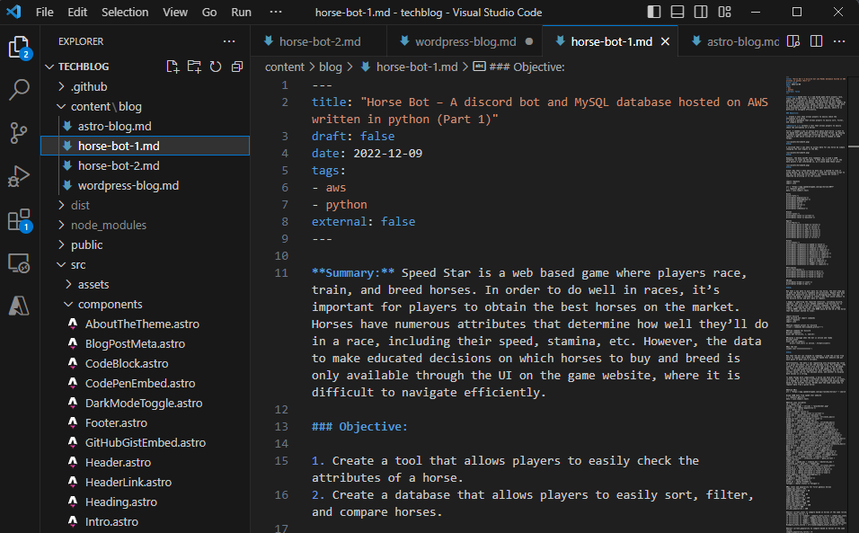
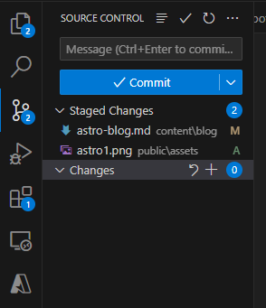
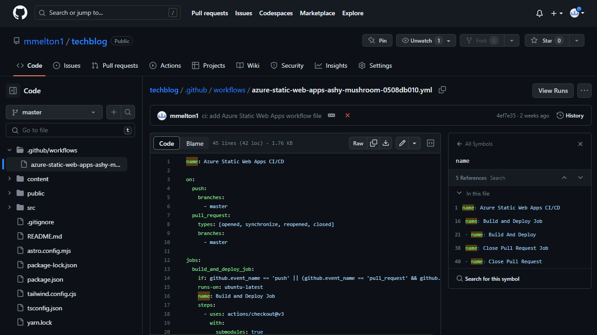
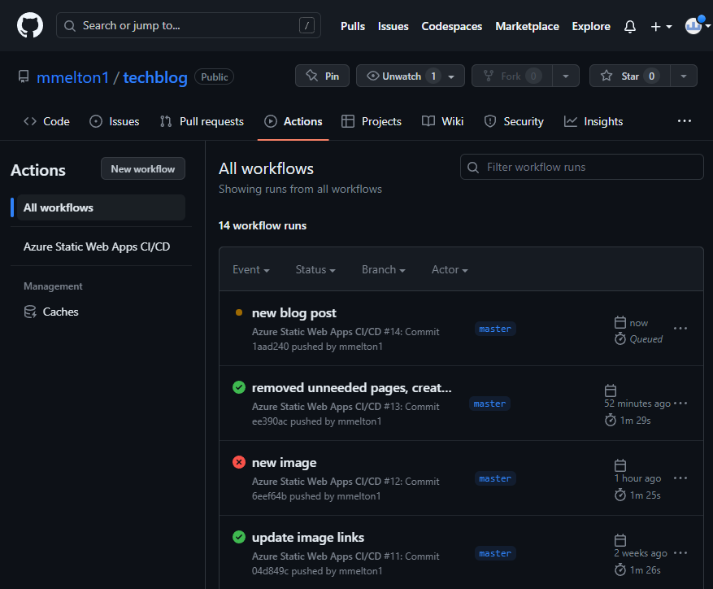
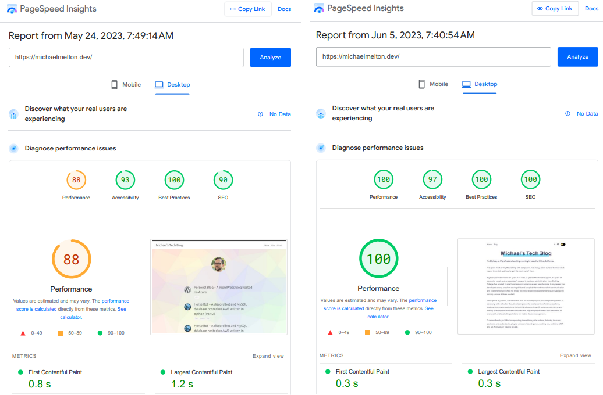

**Summary:** In a previous post, I discussed how I created a Wordpress blog. However, I wanted to learn to use Git and Azure Static Web Apps to create a more performant blog.

## Objectives:

1. Create a fast and low cost blog to document my personal projects.

**Objective 1:** _Create a fast and low cost blog to document my personal projects_

### Researching frameworks

The first step was to research how I wanted to create my blog. Rather than writing HTML, CSS, and javascript from scratch, I decided to test numerous frameworks. After learning and working with Gatsby, Hugo, and Astro (which are all static site generator frameworks), I decided to go with Astro. The workflow of Astro and the documentation made the most sense to me, and I was able to accomplish what I wanted.

I then found a theme that I liked and followed the documentation to setup a new Astro project. Using Astro, I was able to preview the project locally and see changes to my blog in real time. I then started working in Virtual Studio Code to convert my wordpress blog posts to use Markdown, which is what Astro uses to generate content to HTML pages.

&nbsp;

After customizing the theme to fit my needs, I wanted to put my blog on Github. I setup [a repository](https://github.com/mmelton1/techblog) and configured my VS code so that I could sync changes. I confirmed that it was working as expected with a few test commits.

&nbsp;

### Configuring Azure Static Web Apps for deployment

At this point, my blog was working well locally, but I needed to host it somewhere. I decided to use Azure Static Web Apps, as it allowed me to link my blog's code from Github to Azure.

&nbsp;

With the static web app configured, any commits I made in VS code to github would be picked up by azure in order to build my Astro blog. Also, I was able to view any build errors in the github actions section to verify whether a commit was successful, or to resolve any errors.

&nbsp;

Finally, one of my main goals of migrating from wordpress to Astro was performance. Using [Page Speed Insights](https://pagespeed.web.dev/) to measure, I was able to bring the blog's performance score from 88 to 100 (or .3 seconds, down from 4.3 seconds).

&nbsp;
